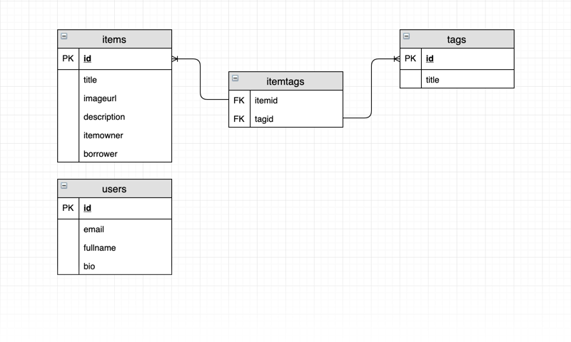
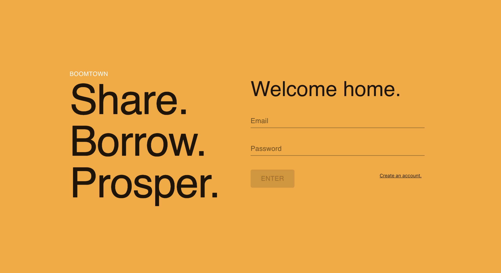
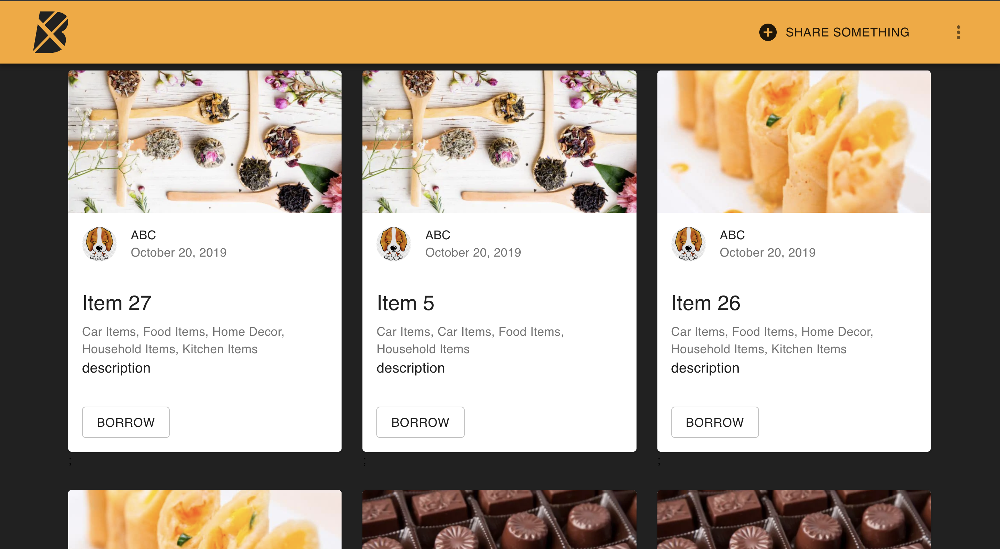
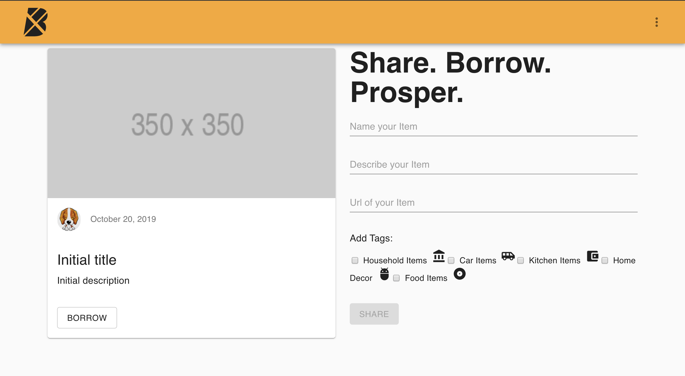
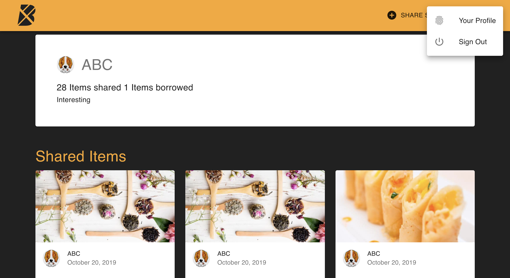

# Boomtown 🏙

## Server

Commands must be run from the `server` directory:

### Installation

```bash
yarn install
```

### Run

```bash
yarn start:dev
```

## Client

Commands must be run from the `client` directory:

### Installation

```bash
yarn install
```

### Run

```bash
yarn start
```

### Build

```bash
yarn run build
```

## Technologies Used

- Apollo Client & Server [](https://www.apollographql.com/)

- PostgreSQL as a relational database to store shareable items and user info [](https://www.postgresql.org/)

- Node.js/Express as its web server [](https://node-postgres.com/)

- GraphQL for its client-facing API. [](https://graphql.org/)

* Express [](https://expressjs.com/)

## Physical Data Model



It represents the actual design blueprint of a relational database and how data should be structured and related in a specific DBMS.

## Preview of the Boomtown App









## Personal Learnings

### PostgreSQL

PostgreSQL, also known as Postgres, is a free and open-source relational database management system (RDBMS) emphasizing extensibility and technical standards compliance. It is designed to handle a range of workloads, from single machines to data warehouses or Web services with many concurrent users. It is the default database for macOS Server,and is also available for Linux, FreeBSD, OpenBSD, and Windows.

PostgreSQL features transactions with Atomicity, Consistency, Isolation, Durability (ACID) properties, automatically updatable views, materialized views, triggers, foreign keys, and stored procedures. PostgreSQL is developed by the PostgreSQL Global Development Group, a diverse group of many companies and individual contributors.

### Node.js

Node.js is an open-source, cross-platform, JavaScript runtime environment that executes JavaScript code outside of a browser. Node.js lets developers use JavaScript to write command line tools and for server-side scripting—running scripts server-side to produce dynamic web page content before the page is sent to the user's web browser. Consequently, Node.js represents a "JavaScript everywhere" paradigm, unifying web application development around a single programming language, rather than different languages for server- and client-side scripts.

A Simple Node App:

Building a TCP Service-

```
const net = require('net');
const server = net.createServer();
server.on('connection', handleConnection);
server.listen(9000, () => {
  console.log('server listening to %j', server.address());
});

  // TODO: Handle connection!
  function handleConnection(conn) {
  const remoteAddressAndPort = `${conn.remoteAddress}:${conn.remotePort}`;
  console.log(`new client connection from ${remoteAddressAndPort}`);
}

```

### Combination of Node-Postgres

This is the simplest possible way to connect, query, and disconnect with async/await:

```
const { Client } = require('pg')
const client = new Client()
await client.connect()
const res = await client.query('SELECT $1::text as message', ['Hello world!'])
console.log(res.rows[0].message) // Hello world!
await client.end()

```

#### Transactions

To execute a transaction with node-postgres you simply execute BEGIN / COMMIT / ROLLBACK queries yourself through a client. Because node-postgres strives to be low level and un-opinionated, it doesn't provide any higher level abstractions specifically around transactions.

A pooled client with async/await:

```
const { Pool } = require('pg')
const pool = new Pool()
;(async () => {
  // note: we don't try/catch this because if connecting throws an exception
  // we don't need to dispose of the client (it will be undefined)
  const client = await pool.connect()
  try {
    await client.query('BEGIN')
    const queryText = 'INSERT INTO users(name) VALUES($1) RETURNING id'
    const res = await client.query(queryText, ['brianc'])
    const insertPhotoText = 'INSERT INTO photos(user_id, photo_url) VALUES ($1, $2)'
    const insertPhotoValues = [res.rows[0].id, 's3.bucket.foo']
    await client.query(insertPhotoText, insertPhotoValues)
    await client.query('COMMIT')
  } catch (e) {
    await client.query('ROLLBACK')
    throw e
  } finally {
    client.release()
  }
})().catch(e => console.error(e.stack))


```

### GraphQL APIs

GraphQL is a query language for APIs and a runtime for fulfilling those queries with your existing data. GraphQL provides a complete and understandable description of the data in your API, gives clients the power to ask for exactly what they need and nothing more, makes it easier to evolve APIs over time, and enables powerful developer tools.

- Send a GraphQL query to your API and get exactly what you need, nothing more and nothing less. GraphQL queries always return predictable results. Apps using GraphQL are fast and stable because they control the data they get, not the server.

- With GraphQL, the schema serves as the contract defined between the client and the server.

- Types and Fields:
  For eg:

```
type Person {
  id: ID!
  name: String!
  birthday: String
  placeOfBirth: String
  bio: String
  filmography: [Movie]
}
type Movie {
  id: ID!
  title: String!
  releaseDate: String
  stars: [Person]
  director: Person
}
```

- Root Query Type:
  For eg:

```
type Query {
  people: [Person]
  person(id: ID!): Person
  movies: [Movie]
  movie(id: ID!): Movie
}

```

- Query Variables

```
query fetchMovie($id: ID!) {
  movie(id: $id) {
    title
  }
}
```

```
Query Variables panel:
{
  "id": 2
}

```

- ### Resolvers

  GraphQL is the best way to work with data from any back-end that your product needs. It is not a mapping of your database, but rather a graph of the data sources and shapes your product is made of. Resolvers are the key to this graph. Each resolver represents a single field, and can be used to fetch data from any source(s) you may have.

  Resolvers provide the instructions for turning a GraphQL operation into data. Resolvers are organized into a one to one mapping to the fields in a GraphQL schema. This section describes resolvers' organization, every field's default resolver, and their signature.

  In order to respond to queries, a schema needs to have resolve functions for all fields. This collection of functions is called the "resolver map". This map relates the schema fields and types to a function.

```
const data = require('./data');

  // Resolvers go here...
  const resolvers = {
  Query: {
    movies() {
      return data.movies;
    },
    movie(root, { id }) {
      return data.movies.find(movie => movie.id === parseInt(id));
    }
  }
  // ...other resolvers

};
module.exports = resolvers;

```

- ### Mutating Data

  We can modify data on the server using a query. However, the common accepted convention is that every operation that includes writes should be sent using a mutation, hence the name of the keyword.

  Despite that, mutations are really much like the query objects we have been writing so far. They too have a type, arguments and a resolve function.

```
// back in ./api/schema.js...
const typeDefs = gql`
  # Other types defined above...
  type Mutation {
    addPerson(
      name: String!
      birthday: String
      placeOfBirth: String
      bio: String
      filmography: [ID]
    ): Person
  }
`;

```

```
Mutation: {
  addPerson(root, args) {
    const newPerson = {
      id: data.people.length + 1,
      name: args.name,
      birthday: args.birthday,
      placeOfBirth: args.placeOfBirth,
      bio: args.bio,
      filmography: args.filmography
    }
    data.people.push(newPerson);
    return newPerson;
  }
}

```

Mutation queries always start with the mutation keyword:

```
mutation createPerson(
  $name: String!
  $placeOfBirth: String
) {
  addPerson(
    name: $name
    placeOfBirth: $placeOfBirth
  ) {
    name
    placeOfBirth
  }
}


```

### React Router

Add this code to your App.js file:

```
import {
  BrowserRouter as Router,
  Route,
  Switch,
  Link,
  Redirect
} from 'react-router-dom';

```

### Router Basics

- BrowserRouter: used to wrap all of the routes we define
- Route: used for identifying each route (inclusively)
- Switch: used to render the first child Route that matches the location
- Link: used to navigate around an application
- Redirect: used to navigate to a new location, like server-side redirects (HTTP 3xx) do

#### Adding the Router

```
const Home = () => <h1>Hello, World!</h1>;
const Contact = () => <h1>Get in touch!</h1>;
class App extends Component {
  render() {
    return (
      <Router>
        <div>
          <Route exact path="/" component={Home} />
          <Route path="/contact" component={Contact} />
        </div>
      </Router>
    );
  }
}


```

### Material-UI

Material-UI components work in isolation. They are self-supporting, and will only inject the styles they need to display. They don't rely on any global style-sheets such as normalize.css.
